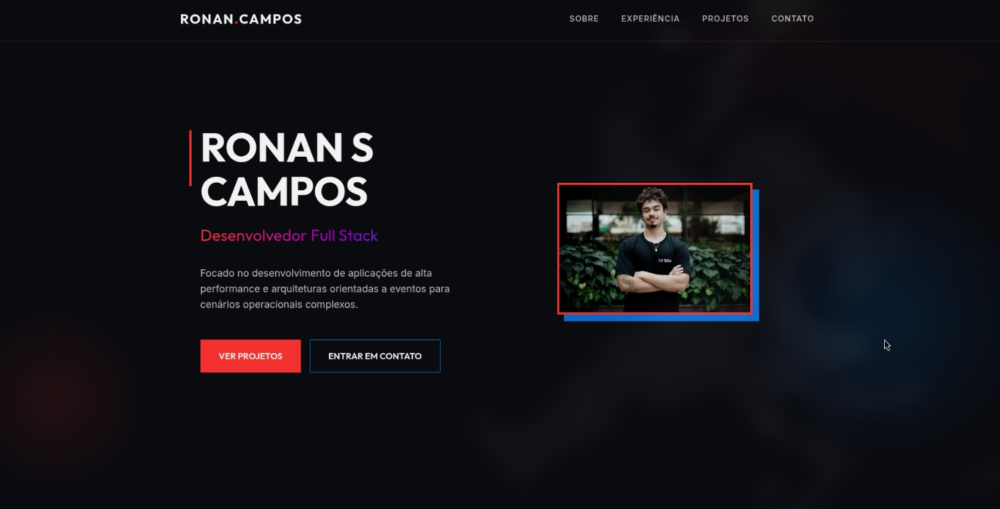

# Ronan S Campos - Portfólio Pessoal



Este é o meu portfólio pessoal de desenvolvimento web. O projeto foi construído para apresentar minha experiência profissional, meus projetos de destaque e fornecer uma forma fácil de contato.

## 🚀 Tecnologias Utilizadas

- **HTML5:** Semântico e acessível.
- **CSS3 (Vanilla):** Sistema de design customizado utilizando variáveis CSS (Custom Properties) para gerenciar o tema escuro com detalhes em vermelho, azul e roxo, além de efeitos premium de hover e animações.
- **JavaScript (Vanilla):** Utilizado para interatividade leve, como scroll suave na navegação e efeitos dinâmicos que não dependem de bibliotecas externas.

## ✨ Funcionalidades

- **Design Responsivo:** Adaptável perfeitamente a dispositivos móveis, tablets e monitores ultrawide.
- **Estética Square:** Todo o layout foi projetado com bordas retas (sem *border-radius*), passando um ar mais tecnológico e rígido.
- **Navegação de "Scroll Suave":** Links de cabeçalho que levam suavemente até as seções correspondentes.
- **Projetos Integrados:**
  - *VHS - Plataforma de Vídeos*
  - *Portfólio Temático de Terminal*
- **Contato Imediato:** Links rápidos para LinkedIn, GitHub e E-mail, além de um botão direto para download do currículo em formato PDF.

## 📁 Estrutura de Arquivos

```text
/
├── index.html        # Estrutura principal da página
├── style.css         # Estilos, variáveis de cores e efeitos visuais
├── script.js         # Comportamentos interativos (scroll, efeitos)
└── assets/           # Diretório contendo imagens e o currículo (cv.pdf)
```

## WEB version 🌐

O site está no ar aqui 👉 [portfolio](https://ronan-sac.github.io/portfolio/)

*Construído com foco e design por Ronan S Campos.*
