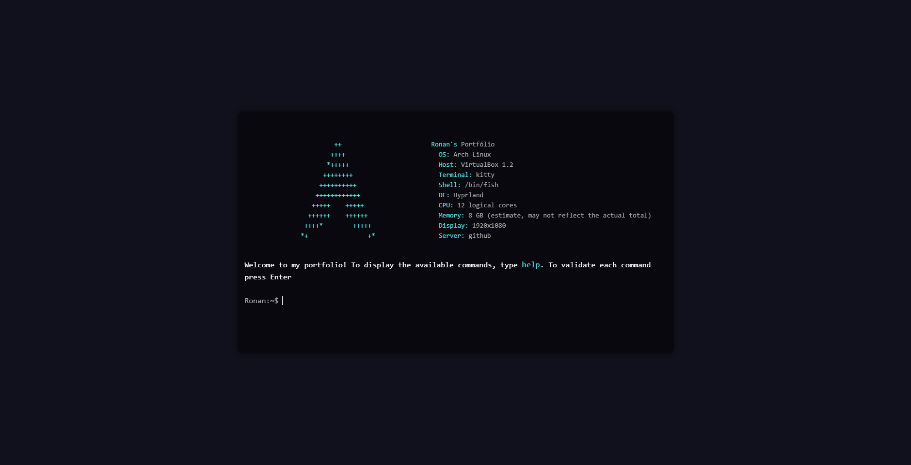

<h1 align="center">
   
  
   
Portfolio Arch Terminal 
</h1>
<h4 align="center">Apresentação de meu portfólio em forma de terminal.</h4>
 

## WEB version 🌐

O site está no ar aqui 👉 [portfolio]()
## Creditos e inspiração 🔗
[Guillaume Reygner](https://github.com/guillaume-rygn)